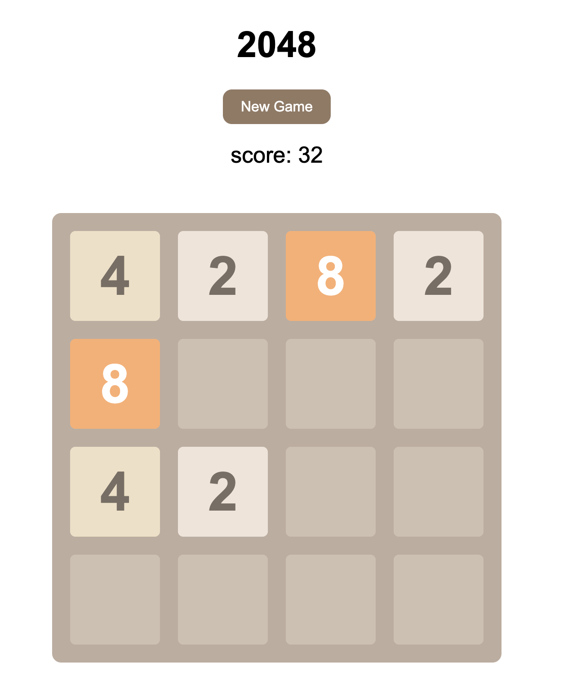

# 2048 Game

A simple and interactive implementation of the popular 2048 game using vanilla JavaScript, HTML, and CSS.



## How to Play

- Use the arrow keys to move tiles up, down, left, or right.
- When two tiles with the same number touch, they merge into one.
- Try to create a tile with the number 2048 to win the game!

## Project Structure

```bash
.
├── assets           # The directory for game screenshots
├── index.html       # The main HTML file
├── 2048.css         # The main CSS file for styling
├── main.js          # The main JavaScript file for game logic
├── keyboard.js      # Handles keyboard inputs, movements and game ending
├── helpers.js       # Some helper functions
└── README.md        # Project documentation
